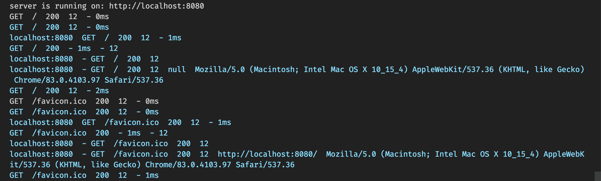

# OAK Middlewares

This is collection of Custom middleware for [oak server](https://github.com/oakserver/oak).

## requestTraceMiddleware

inspired by [morgan](https://expressjs.com/en/resources/middleware/morgan.html)

**import:**

```ts
import { requestTraceMiddleware } from "https://raw.githubusercontent.com/deepakshrma/oak_middlewares/master/mod.ts";
```

**How to use it:**

```ts
import { Application, Middleware } from "https://deno.land/x/oak/mod.ts";
import { requestTraceMiddleware } from "https://raw.githubusercontent.com/deepakshrma/oak_middlewares/master/mod.ts";

const app = new Application();

app.use(requestTraceMiddleware<Middleware>());
app.use(
  requestTraceMiddleware<Middleware>({ type: "combined" })
);
app.use(
  requestTraceMiddleware<Middleware>({ type: "common" })
);
app.use(
  requestTraceMiddleware<Middleware>({ type: "dev" })
);
app.use(
  requestTraceMiddleware<Middleware>({ type: "short" })
);

// This will not print since log level is higher
// More options: import { Logger, LoggerOptions } from "https://deno.land/x/deno_util/logger.ts";
app.use(
  requestTraceMiddleware<Middleware>({
    type: "tiny",
    loggerOptions: { level: 1 },
  })
);

// Disable logger, use raw console.log
app.use(
  requestTraceMiddleware<Middleware>({
    type: "tiny",
    raw: true,
  })
);

app.use((ctx) => {
  ctx.response.body = "Hello world!";
});
console.log("server is running on: http://localhost:8080");
await app.listen(":8080");
```

**How to run:**

```bash
deno run -A examples/request_trace_demo.ts
```

**Output:**



### types

| type     | format                                                                      |
| -------- | --------------------------------------------------------------------------- |
| combined | ":remote-addr - :method :url :status :content-length :referrer :user-agent" |
| common   | ":remote-addr - :method :url :status :content-length"                       |
| dev      | ":method :url :status :response-time - :content-length"                     |
| short    | ":remote-addr :method :url :status :content-length :response-time"          |
| tiny     | ":method :url :status :content-length :response-time"                       |

More examples: [examples](/examples)

**Note:** Lib is still WIP

Cheers! keep coding!
